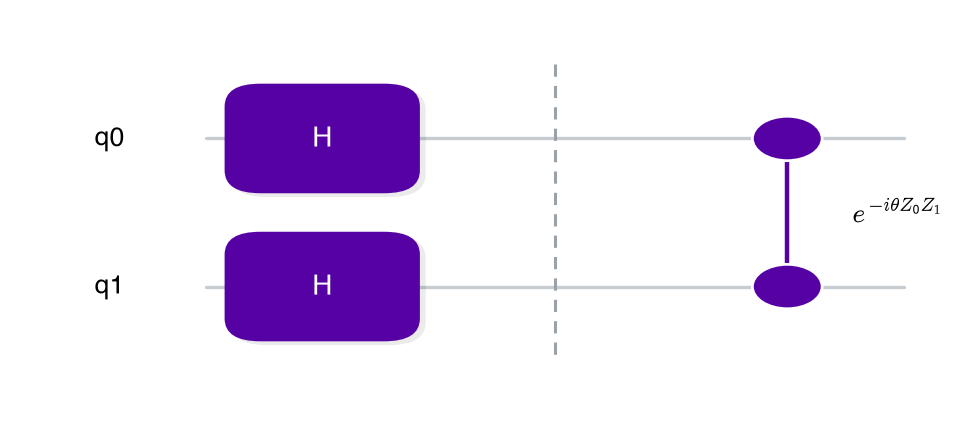
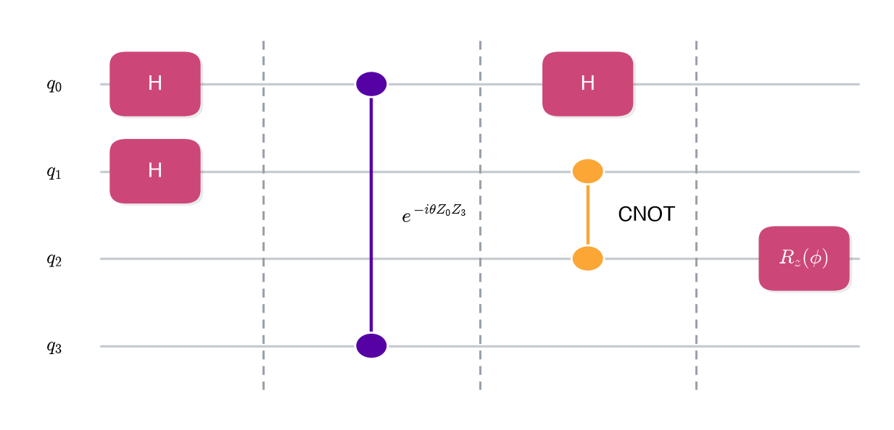

# gatefold

Quantum circuit diagram plotting that is:

- **Lightweight** — the only dependency is matplotlib. 
- **Adaptable** — gatefold can accept any circuit representation. Just write a small adapter converting your package's circuit objects into a `list[Layer]`.
- **Sleek** — a considered default palette, mathtext labels, auto-fit text, and clean packing.

```bash
pip install gatefold
# or
uv add gatefold
```

## Usage

`gatefold`'s whole vocabulary is `Item` (something drawn on one or more qubit
rows) grouped into `Layer`s (packed left-to-right, ASAP, with a barrier
between layers). 

Labels support matplotlib mathtext, e.g. `r"$Z_0 Z_1^\dagger$"`.
Runnable versions of the examples below are in
[`examples/examples.ipynb`](examples/examples.ipynb).

```python
from gatefold import Item, Layer, plot_circuit

layers = [
    Layer(items=[Item(("q0",), "H"), Item(("q1",), "H")]),
    Layer(items=[Item(("q0", "q1"), r"$e^{-i\theta Z_0 Z_1}$")]),
]
ax = plot_circuit(layers)
```

<br>



<br>

Items can span more than two rows, and a `style` key looks up a `Palette`
entry to color-code gates (e.g. by arity):

```python
from gatefold import Item, Layer, plot_circuit, set_clean_rcparams

set_clean_rcparams()  # LaTeX-like typography, call once at import time

layers = [
    Layer(items=[Item(("q0",), "H", style="single"), Item(("q1",), "H", style="single")]),
    Layer(items=[Item(("q0", "q3"), r"$e^{-i\theta Z_0 Z_3}$")]),
    Layer(items=[Item(("q0",), "H", style="single"), Item(("q1", "q2"), "CNOT", style="multi")]),
    Layer(items=[Item(("q2",), r"$R_z(\phi)$", style="single")]),
]
ax = plot_circuit(layers, qubit_display={"q0": "$q_0$", "q1": "$q_1$", "q2": "$q_2$", "q3": "$q_3$"})
```

<br>



<br>

## Writing an adapter

An adapter is a single function, `your_circuit ( + metadata) -> list[Layer]`. It's the
only place that needs to know about both your package and `gatefold`. This is what the adapter needs to do: 

- For each gate/term in the circuit you input, it must infer three things to construct an `Item`: which qubits the gate touches (`tuple`), a label (plain text or mathtext), and a `style` key. 
  
- Your package likely has methods to look up the first two properties from the gate/term objects the circuit is built from. If not, you need to pass metadata from which they can be inferred. 

- `style` is yours to define. `gatefold` just uses it to look up a
  `StyleSpec` in a `Palette` you can define. The `Palette` is a dictionary mapping the "types" of gates you want to the `StyleSpec` you want to decorate them with. For instance, you might want different styles for gates of different -arity, hardware-native vs. symbolic, etc. The adapter function must be able to infer these types and attach the appropriate style as the third argument of the `Item` class. 

- If your source representation has several sub-types (e.g. hardware gates vs.
  symbolic terms vs. encoded terms), each branch can have completely
  different internal logic captured in its own adapter function as long as every branch ends up emitting the
  same valid `list[Layer]`.

## License

MIT
